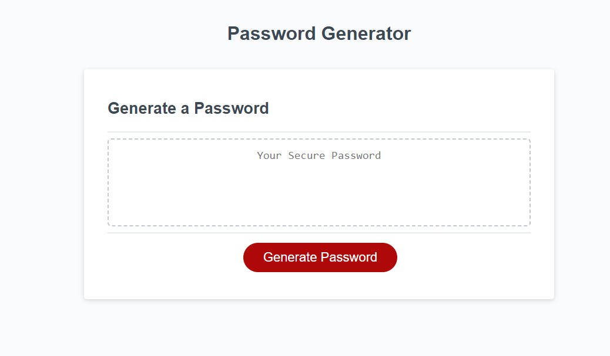

# Password Generator

## Description

A simple password generator that takes in user input to determine what type of characters (eg. Lowercase, Uppercase, Numbers, Special Characters) are to be used for the password generation.

## Installation

Once the repo has been downloaded, you can open the webpage by opening on the index.html file

## Usage

https://monstergog.github.io/PasswordGenerator/

Once the webpage is opened, press the "Generate Password" button. Then follow the instructions given by the on-screen prompts to generate your password.

## License

N/A

---